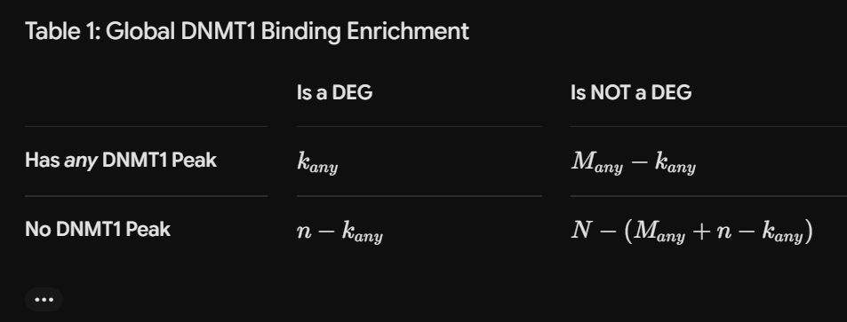
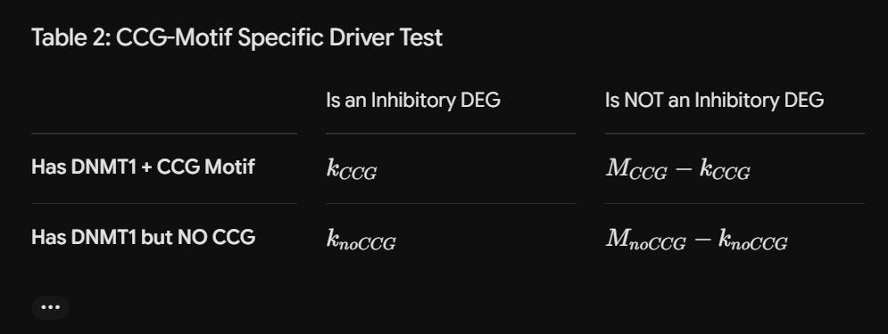

# MOTIF ENRICHMENT ANALYSIS ACROSS INHIBITORY AND EXCITATORY NEURONS
# Step 1: Download Data (Yinuo will do this and put on Github)

Sample file directories:
Path to the normalized expression matrix:
/u/project/gxxiao/annafras/WGCNA/SEAAD_DLPFC/merged.tpm.*.txt

Path to the metadata for the samples: 
/u/project/gxxiao/annafras/WGCNA/SEAAD_DLPFC/metadata_snRNAseq_SEA-AD_DLPFC_with_mapping.txt

eCLIP DNMT1 interaction region:
Local on Yinuo's computer (temporarily)

How to make a gtf? Adaptable code at:
/u/home/y/yinuoliu/project-gxxiao/Parkinsons_pro/submitDownload/step13/make_gtf.R

# Step 2: Make gtf file (Prep for later steps)
We need the gtf file to identify the gene regions for the coordinates stored in the bed file identified as DNMT1 interation sites for which we look into the expression matrix and then do comparison.

Motif Analysis:

Split your eCLIP peaks into two groups to test the CCG motif hypothesis:
Group A: DNMT1 binding sites with the CCG motif.
Group B: DNMT1 binding sites without the CCG motif.

You can use a tool like Homer (findMotifsGenome.pl) or MEME-ChIP on your eCLIP BED file to scan the underlying genomic sequences for the CCG motif.

# Step 3: Filter the samples that contain the two cell types of interest (inhibitory and excitatory neurons) 

Use the metadata to filter for the samples (normalized expression matrix) that are inhibitory and exitatory neurons.

# Step 4: Differential Gene Expression Analysis

Check out the standard protocol for doing this

=> A graph where each dot is a region, x-axis is expression in inhibitory, y-axis is expression in exitatory.

# Step 5: Overlap the differentially expressed genes with genes identified in the gtf

Do this for both the CCG motif, and other interaction sites.

=> A graph (Venn Diagram or something similar) to represent the overlap of the regions.

# Step 6: Calculate significance (Fisher Test)

Essentially, we are asking whether this overlap is significant or could be explained by chance. 

The 4 Numbers We Need:
k (Overlap): The number of DEGs that do overlap a DNMT1 region.
n (Total DEGs): The total number of DEGs you found between your two cell types.
M (Total DNMT1 Genes): The total number of genes in the genome that have a DNMT1 interaction (whether they are DE or not).
N (The Background/Universe): The total number of genes measured in your expression matrix.

Instead of running just one Fisher test, run two separate Fisher tests to see if the CCG motif is the actual driver of vulnerability in inhibitory neurons:

Test 1: Are DEGs enriched for any DNMT1 binding?

Test 2: Are Inhibitory-specific DEGs more significantly enriched for CCG-motif containing DNMT1 sites compared to non-CCG sites?

Filter for the regions that pass the Fisher Test:

=> Graphs where x-axis is the gene region, upper y-axis is expression in inhibitory, and lower is expression in exitatory.

# Visualizing the Results (The Graphs) - For reference only

Graph 1 (Step 4): Scatter Plot of ExpressionWhat it is: A global look at your two cell types before looking at DNMT1. X-axis: Mean expression (TPM) in Inhibitory Neurons.Y-axis: Mean expression (TPM) in Excitatory Neurons.What the dots mean: Every dot is a gene. Genes lying on the diagonal line (y = x) are expressed equally. Genes far away from the diagonal are your DEGs. Tip: Color the dots that pass your DEG threshold (e.g., p_adj < 0.05 and |log_2FC| > 1) in red or blue.

Graph 2 (Step 5): The Overlap BreakdownOnce you have your DEGs, you want to show how they intersect with your custom eCLIP-mapped genes. A fantastic way to visualize this prior to the formal statistical test is a Venn Diagram or an Upset Plot showing the intersection between your DEG list and your two DNMT1 gene lists (with/without motif).

Graph 3 (Step 6): Mirrored Expression / Coverage Plot across Target RegionsWhat it is: A deeply detailed biological look at your validated, significant target regions. X-axis: The relative position across the gene region (e.g., from 1kb upstream of the Transcription Start Site to the Transcription End Site). Upper Y-axis: Average normalized expression/read coverage track for Inhibitory Neurons.Lower Y-axis: Average normalized expression/read coverage track for Excitatory Neurons.

How to make it: You cannot easily build this from a flat TPM expression matrix because a matrix collapses a whole gene into a single number. To get a true "x-axis is the gene region" plot showing a profile across the gene body, you will need to point to your raw data alignment files (like BigWig files derived from your samples) and use a tool like pyGenomeTracks or R's Gviz package to plot the mirrored coverage tracks over your final Fisher-significant genes.

# Designing the Final Fisher Contingency Tables

When you write the code for Step 6, your environment will calculate two separate 2 X 2 matrices to feed into fisher.test() in R or scipy.stats.fisher_exact in Python:

Table 1: Global DNMT1 Binding Enrichment

Table 2: CCG-Motif Specific Driver Test
